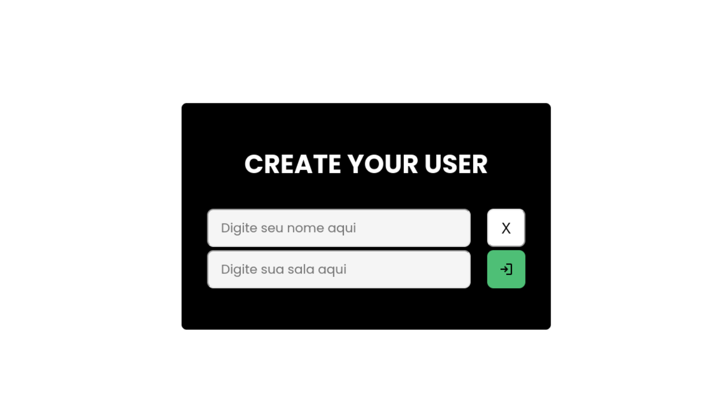
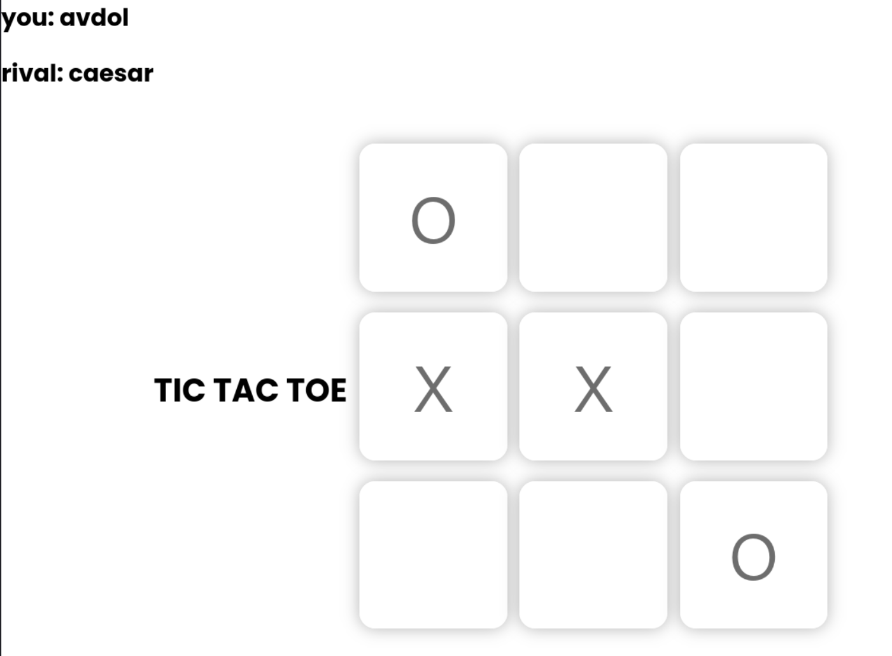

# 🎮 Jogo da Velha com WebSockets

<div align="center">
  
  
  
  
  
  
</div>

Um jogo da velha multiplayer em tempo real desenvolvido para explorar o poder dos WebSockets com Socket.io, Node.js e Express.

## ✨ Funcionalidades

- 🔄 Comunicação em tempo real entre jogadores
- 🎯 Lógica completa do jogo da velha
- 📊 Controle de turnos e vitórias

## 🛠️ Tecnologias Utilizadas

- **Backend**: Node.js com Express
- **Frontend**: JavaScript puro + Handlebars para templates
- **Comunicação**: Socket.io para conexões WebSocket
- **Estilização**: CSS

## 📸 Preview
<div>
  
  - **Render**: https://jogodavelha-soulkaku.onrender.com
  
</div>
<div>




</div>

## 🚀 Como Executar

1. Clone o repositório:
   ```bash
   https://github.com/Soulkaku/JogoDaVelha.git

2. Instale as dependências:
   ```bash
   npm install

3. Inicie o servidor:
   ```bash
   npm run dev

4. Acesse no navegador:
   ```bash
   http://localhost:3000

<div align="center"> Feito por Thiago Gonçalves (ThiagoGont) | ✉️ hellothigo.devb@gmail.com </div> 
